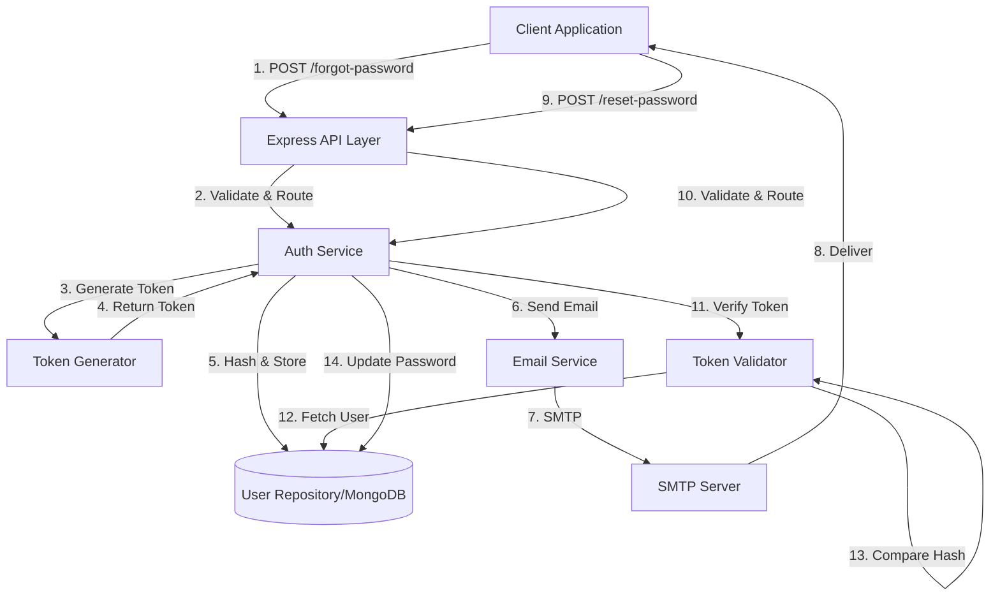

# Design Document: Secure Password Reset System

## Overview

This design document describes a secure password reset system that replaces the current JWT-based implementation with a cryptographically secure, single-use token approach. The system integrates nodemailer for email delivery and implements security best practices including token hashing, expiration, and protection against user enumeration attacks.

The design addresses the following key security improvements:
- Replaces non-revocable JWT tokens with single-use, hashed tokens
- Implements proper email delivery for reset tokens
- Adds comprehensive token validation and expiration
- Maintains OAuth provider protection
- Implements secure error handling to prevent user enumeration

## Architecture

### High-Level Architecture



### Component Interaction Flow

1. **Forgot Password Flow**:
   - Client submits email address
   - System generates secure random token
   - Token is hashed and stored with expiration
   - Plain-text token is sent via email
   - Generic success response returned (regardless of email existence)

2. **Reset Password Flow**:
   - Client submits token and new password
   - System retrieves user and validates token
   - Token is compared against stored hash
   - Password is updated and reset fields cleared
   - Success response returned

## Components and Interfaces

### 1. Token Generator Module

**Location**: `utils/tokenGenerator.js`

**Purpose**: Generate cryptographically secure random tokens for password reset operations.

**Interface**:
```javascript
/**
 * Generate a secure random token
 * @returns {string} Hexadecimal token string (64 characters from 32 bytes)
 */
function generateResetToken()
```

**Implementation Details**:
- Uses Node.js `crypto.randomBytes(32)` for cryptographic randomness
- Converts bytes to hexadecimal string for URL-safe transmission
- Returns 64-character hex string (32 bytes = 64 hex chars)

### 2. Email Service Module

**Location**: `services/emailService.js`

**Purpose**: Handle all email operations using nodemailer, specifically for sending password reset emails.

**Interface**:
```javascript
/**
 * Send password reset email
 * @param {Object} options - Email options
 * @param {string} options.email - Recipient email address
 * @param {string} options.resetToken - Plain-text reset token
 * @param {string} options.userName - User's name for personalization
 * @returns {Promise<void>}
 * @throws {Error} If email sending fails
 */
async function sendPasswordResetEmail({ email, resetToken, userName })

/**
 * Get configured nodemailer transporter
 * @returns {Object} Nodemailer transporter instance
 */
function getEmailTransporter()
```

**Configuration** (Environment Variables):
- `SMTP_HOST`: SMTP server hostname
- `SMTP_PORT`: SMTP server port (typically 587 for TLS, 465 for SSL)
- `SMTP_USER`: SMTP authentication username
- `SMTP_PASS`: SMTP authentication password
- `EMAIL_FROM`: Sender email address
- `SMTP_SECURE`: Boolean for TLS/SSL (optional, defaults to false)
- `RESET_URL_BASE`: Base URL for reset links (e.g., `https://app.example.com/reset-password`)

**Email Template**:
- HTML and plain-text versions
- Includes personalized greeting
- Contains plain-text token for manual entry
- Contains clickable link with token as query parameter
- Includes expiration warning (5 minutes)
- Includes security notice about not sharing the link

### 3. Token Validator Module

**Location**: `utils/tokenValidator.js`

**Purpose**: Validate reset tokens against stored hashes and expiration times.

**Interface**:
```javascript
/**
 * Validate a password reset token
 * @param {Object} user - User document from database
 * @param {string} providedToken - Token provided by client
 * @returns {Promise<Object>} Validation result
 * @returns {boolean} result.valid - Whether token is valid
 * @returns {string} result.reason - Reason for invalidity (if applicable)
 */
async function validateResetToken(user, providedToken)
```

**Validation Logic**:
1. Check if user has a passwordResetToken (token exists)
2. Check if passwordResetExpires is in the future (not expired)
3. Compare providedToken against passwordResetToken using bcrypt.compare()
4. Return validation result with reason for failure

### 4. Updated Auth Service

**Location**: `services/authService.js`

**Modified Functions**:

```javascript
/**
 * Handle forgot password request
 * @param {Object} req - Express request object
 * @param {Object} res - Express response object
 * @param {Function} next - Express next middleware
 */
async function forgotPassword(req, res, next)

/**
 * Handle password reset request
 * @param {Object} req - Express request object
 * @param {Object} res - Express response object
 * @param {Function} next - Express next middleware
 */
async function resetPassword(req, res, next)
```

**forgotPassword Implementation**:
1. Extract email from request body
2. Query user by email (select reset fields)
3. Check if user exists (continue regardless for security)
4. Check OAuth provider (reject if not 'local')
5. Generate secure token using Token Generator
6. Hash token using bcrypt (salt rounds: 10)
7. Store hashed token, expiration (Date.now() + 5 minutes), and set passwordResetVerifies to false
8. Send email using Email Service
9. Return generic success message
10. Log operation

**resetPassword Implementation**:
1. Extract token from query parameter OR request body (prioritize query)
2. Extract new password from request body
3. Extract email from request body (for user lookup)
4. Query user by email (select password reset fields)
5. Check if user exists (return error if not)
6. Check OAuth provider (reject if not 'local')
7. Validate token using Token Validator
8. If invalid, return generic error
9. Update password (triggers bcrypt hashing middleware)
10. Update passwordChangedAt to Date.now()
11. Clear passwordResetToken, passwordResetExpires, passwordResetVerifies
12. Save user document
13. Return success message
14. Log operation

### 5. Validator Updates

**Location**: `middleware/validators/authValidator.js`

**Updated Validators**:

```javascript
// Forgot password validator
exports.validateForgotPassword = runValidation([
  check('email')
    .trim()
    .notEmpty()
    .withMessage('Email is required')
    .isEmail()
    .withMessage('Invalid email format')
    .normalizeEmail()
]);

// Reset password validator
exports.validateResetPassword = runValidation([
  check('email')
    .trim()
    .notEmpty()
    .withMessage('Email is required')
    .isEmail()
    .withMessage('Invalid email format')
    .normalizeEmail(),
  
  check('token')
    .trim()
    .notEmpty()
    .withMessage('Reset token is required')
    .isLength({ min: 64, max: 64 })
    .withMessage('Invalid token format')
    .isHexadecimal()
    .withMessage('Invalid token format'),
  
  check('password')
    .trim()
    .notEmpty()
    .withMessage('Password is required')
    .isLength({ min: 6 })
    .withMessage('Password must be at least 6 characters')
]);
```

**Note**: Token can come from query parameter or body. Validation should check both locations.

## Data Models

### User Model Updates

**Location**: `models/userModel.js`

**Existing Fields** (no changes needed):
```javascript
{
  passwordResetToken: {
    type: String,
    select: false
  },
  passwordResetExpires: {
    type: Date,
    select: false
  },
  passwordResetVerifies: {
    type: Boolean,
    select: false
  }
}
```

**Usage**:
- `passwordResetToken`: Stores bcrypt hash of the reset token
- `passwordResetExpires`: Stores expiration timestamp (Date.now() + 5 minutes)
- `passwordResetVerifies`: Boolean flag (set to false when token generated, not currently used for validation but maintained for compatibility)

### Email Configuration Model

**Location**: `config/emailConfig.js`

**Structure**:
```javascript
module.exports = {
  smtp: {
    host: process.env.SMTP_HOST,
    port: parseInt(process.env.SMTP_PORT, 10) || 587,
    secure: process.env.SMTP_SECURE === 'true',
    auth: {
      user: process.env.SMTP_USER,
      pass: process.env.SMTP_PASS
    }
  },
  from: process.env.EMAIL_FROM || 'noreply@example.com',
  resetUrlBase: process.env.RESET_URL_BASE || 'http://localhost:3000/reset-password'
};
```

## Correctness Properties


A property is a characteristic or behavior that should hold true across all valid executions of a system—essentially, a formal statement about what the system should do. Properties serve as the bridge between human-readable specifications and machine-verifiable correctness guarantees.

### Property 1: Token Format Validity

*For any* generated reset token, the token SHALL be a valid hexadecimal string of exactly 64 characters (representing 32 bytes).

**Validates: Requirements 1.1, 1.3**

### Property 2: Token Storage Security

*For any* password reset request, the token stored in the database SHALL be a bcrypt hash and SHALL NOT be the plain-text token.

**Validates: Requirements 1.4**

### Property 3: Expiration Time Accuracy

*For any* generated reset token, the passwordResetExpires field SHALL be set to a timestamp approximately 5 minutes (300,000 milliseconds ± 1000ms) in the future from the time of generation.

**Validates: Requirements 2.1**

### Property 4: Token Invalidation After Use

*For any* successful password reset operation, the passwordResetToken, passwordResetExpires, and passwordResetVerifies fields SHALL all be cleared (set to undefined/null or false).

**Validates: Requirements 2.2**

### Property 5: Email Content Completeness

*For any* password reset email sent, the email body SHALL contain both the plain-text reset token and a clickable URL with the token as a query parameter.

**Validates: Requirements 3.2, 3.3**

### Property 6: Email Delivery Invocation

*For any* valid password reset request for a local account, the Email_Service SHALL be invoked with the correct recipient email address.

**Validates: Requirements 3.1**

### Property 7: Invalid Token Rejection

*For any* password reset attempt with an incorrect token, the Token_Validator SHALL reject the request and return a generic error message.

**Validates: Requirements 4.3**

### Property 8: Valid Token Acceptance

*For any* password reset attempt with a valid, non-expired token, the Token_Validator SHALL allow the password reset to proceed successfully.

**Validates: Requirements 4.5**

### Property 9: OAuth Account Protection

*For any* user account where oauthProvider is not 'local', both forgotPassword and resetPassword operations SHALL reject the request with an error message indicating the OAuth provider.

**Validates: Requirements 6.2, 6.3**

### Property 10: User Enumeration Prevention

*For any* two password reset requests (one for an existing email and one for a non-existing email), the response message format and status code SHALL be identical.

**Validates: Requirements 7.2**

### Property 11: Error Message Consistency

*For any* two failed password reset attempts (one with an expired token and one with an invalid token), the error message SHALL be identical and generic.

**Validates: Requirements 7.4, 7.5**

### Property 12: Password Update Round-Trip

*For any* successful password reset with a new password, the updated password SHALL be hashed in the database, and subsequent login attempts with the new password SHALL succeed.

**Validates: Requirements 8.1, 8.2**

### Property 13: Timestamp Update

*For any* successful password reset operation, the passwordChangedAt field SHALL be updated to a timestamp within 1 second of the current time.

**Validates: Requirements 8.3**

## Error Handling

### Error Categories

1. **Validation Errors** (400 Bad Request):
   - Missing email address
   - Invalid email format
   - Missing reset token
   - Invalid token format (not 64-char hex)
   - Missing new password
   - Password too short

2. **Authentication Errors** (400 Bad Request):
   - Invalid or expired reset token (generic message: "Invalid or expired reset token")
   - OAuth account attempting password reset (specific message: "Cannot reset password for {provider} accounts")

3. **Server Errors** (500 Internal Server Error):
   - Email service failure
   - Database operation failure
   - Token generation failure

### Error Response Format

All errors follow the ApiError class format:
```javascript
{
  status: 'error',
  message: 'Error message here',
  statusCode: 400
}
```

### Security Considerations

1. **Generic Success Messages**: Always return the same success message for forgot password requests, regardless of whether the email exists:
   ```javascript
   {
     status: 'success',
     message: 'If an account with that email exists, a password reset link has been sent.'
   }
   ```

2. **Generic Error Messages**: Use consistent error messages for token validation failures:
   - Don't distinguish between "token expired" and "token invalid"
   - Don't reveal whether a user exists
   - Use: "Invalid or expired reset token"

3. **Rate Limiting**: The existing express-rate-limit middleware should be applied to password reset endpoints to prevent abuse.

4. **Logging**: Log all password reset attempts with email addresses for security monitoring, but don't expose this information in responses.

## Testing Strategy

### Dual Testing Approach

This feature requires both unit tests and property-based tests to ensure comprehensive coverage:

- **Unit tests**: Verify specific examples, edge cases, and error conditions
- **Property tests**: Verify universal properties across all inputs

Both testing approaches are complementary and necessary. Unit tests catch concrete bugs in specific scenarios, while property tests verify general correctness across a wide range of inputs.

### Property-Based Testing

**Library**: Use `fast-check` for JavaScript/Node.js property-based testing.

**Configuration**:
- Each property test MUST run a minimum of 100 iterations
- Each test MUST include a comment tag referencing the design property
- Tag format: `// Feature: secure-password-reset, Property {number}: {property_text}`

**Property Test Coverage**:
- Property 1: Generate 100+ tokens and verify format
- Property 2: Generate 100+ reset requests and verify hashing
- Property 3: Generate 100+ tokens and verify expiration timing
- Property 4: Perform 100+ successful resets and verify field clearing
- Property 5: Generate 100+ emails and verify content
- Property 6: Generate 100+ requests and verify email service calls
- Property 7: Generate 100+ invalid tokens and verify rejection
- Property 8: Generate 100+ valid tokens and verify acceptance
- Property 9: Generate 100+ OAuth accounts and verify rejection
- Property 10: Generate 100+ pairs of requests and verify response consistency
- Property 11: Generate 100+ failed attempts and verify error consistency
- Property 12: Perform 100+ password resets and verify round-trip
- Property 13: Perform 100+ resets and verify timestamp updates

### Unit Testing

**Test Categories**:

1. **Token Generator Tests**:
   - Verify token length is 64 characters
   - Verify token is hexadecimal
   - Verify tokens are unique (generate multiple)

2. **Email Service Tests**:
   - Mock nodemailer transporter
   - Verify email is sent with correct recipient
   - Verify email contains token
   - Verify email contains reset URL
   - Verify error handling when email fails

3. **Token Validator Tests**:
   - Valid token passes validation
   - Invalid token fails validation
   - Expired token fails validation
   - Missing token fails validation

4. **Auth Service Tests**:
   - forgotPassword with existing email
   - forgotPassword with non-existing email (same response)
   - forgotPassword with OAuth account (rejected)
   - resetPassword with valid token
   - resetPassword with invalid token
   - resetPassword with expired token
   - resetPassword with OAuth account (rejected)
   - resetPassword clears reset fields
   - resetPassword updates passwordChangedAt

5. **Integration Tests**:
   - Full forgot password flow
   - Full reset password flow
   - Token expiration after 5 minutes
   - Token single-use enforcement

### Edge Cases

The following edge cases should be explicitly tested:

1. **Expired tokens**: Tokens past the 5-minute expiration
2. **Email service failures**: When nodemailer throws errors
3. **Token in query vs body**: Precedence when both provided
4. **Missing token**: Neither query nor body contains token
5. **OAuth accounts**: All OAuth providers (google, facebook, github)
6. **Non-existent emails**: Forgot password for emails not in system
7. **Empty/whitespace passwords**: Password validation edge cases
8. **Concurrent reset requests**: Multiple tokens generated for same user

### Test Environment Setup

**Required Mocks**:
- Nodemailer transporter (use nodemailer-mock or similar)
- MongoDB test database (use mongodb-memory-server)
- Environment variables for email configuration

**Test Data**:
- Sample users with local accounts
- Sample users with OAuth accounts
- Valid and invalid tokens
- Expired tokens (manipulate timestamps)

### Coverage Goals

- Line coverage: >90%
- Branch coverage: >85%
- Function coverage: 100%
- Critical paths: 100% (token generation, validation, password reset)
